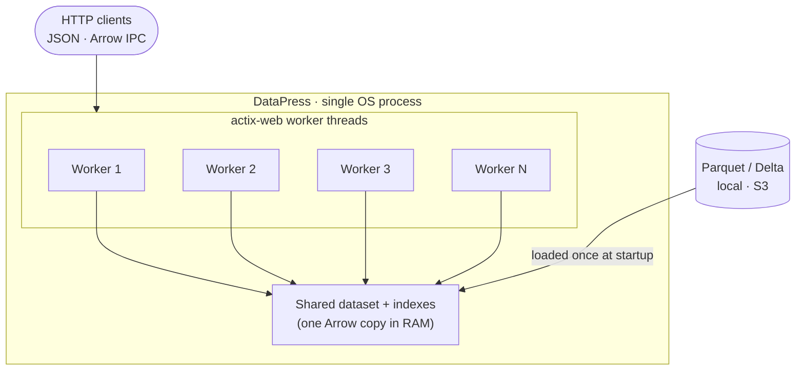
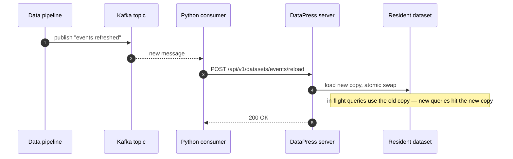

# DataPress


Turn Parquet and Delta datasets into fast, typed HTTP APIs without
standing up a warehouse, writing a service layer, or moving data out of
object storage.

DataPress is a small Rust data server for teams that already have
columnar files and need a dependable way to publish them: JSON for
applications, Arrow IPC for analytics clients, health probes for
orchestrators, and a Python package for notebooks, jobs, and embedded
services.

```bash
pip install datap-rs
```

Prefer a standalone binary? Install it from crates.io — one `datapress`
command bundles both the DuckDB and DataFusion backends:

```bash
cargo install datapress
```

```python
from datap_rs.datapress import DataPress, DataPressConfig, DatasetConfig

server = DataPress(
    DataPressConfig(backend="duckdb", port=8000),
    datasets=[DatasetConfig(name="events", source="s3://lake/events/*.parquet")],
)
```

<div class="grid cards" markdown>

- **Publish data where it lives**

  Serve local files, S3-compatible buckets, Parquet partitions, and
  Delta tables through one predictable API.

- **Choose the execution engine**

  Run the same request model on DuckDB or Apache Arrow + DataFusion and
  compare them under the same workload.

- **Serve apps and analysts**

  Return paged JSON for product surfaces or Arrow IPC streams for
  Python, Polars, DuckDB, notebooks, and downstream pipelines.

- **Operate it like a service**

  Use readiness/liveness probes, version metadata, graceful shutdown,
  Prometheus metrics, hot reloads, and optional OIDC/OAuth2 scopes.

</div>

## What It Does

DataPress exposes configured datasets over a versioned HTTP API:

- discover datasets and schemas;
- query columns with predicates, sorting, grouping, aggregation,
  distinct, limits, and pagination;
- count matching rows without fetching them;
- stream large results as Arrow IPC;
- reload datasets without restarting the server;
- enforce bearer-token scopes when OIDC/OAuth2 auth is enabled.

The goal is not to replace your lakehouse, database, or BI platform. It
is the thin, fast publication layer between columnar data and the people
or systems that need to consume it.

## Who It Helps

<div class="grid cards" markdown>

- **Data engineers**

  Publish curated Parquet or Delta outputs directly from pipelines.
  Avoid bespoke Flask/FastAPI wrappers, schema hand-coding, and repeated
  export jobs.

- **Application developers**

  Query datasets with a stable HTTP contract instead of linking against
  storage-specific readers or embedding SQL engines into every service.

- **Analytics engineers**

  Give notebooks and jobs an Arrow-native path for bulk pulls while
  still supporting lightweight JSON inspection and operational APIs.

- **Business teams**

  Turn governed files into reusable data products: documented,
  discoverable, reloadable, and protected by familiar OAuth2 scopes.

</div>

## Why It Is Fast

DataPress leans on columnar formats and mature query engines instead of
serialising everything through an application ORM.

- **Rust + actix-web** keeps the HTTP layer compact and predictable.
- **DuckDB** is excellent for huge or growing datasets, lazy reads,
  object storage, Delta, and rich SQL execution.
- **Apache Arrow + DataFusion** gives a pure-Rust path with resident
  Arrow batches and optional equality indexes for hot point lookups.
- **Arrow IPC** avoids JSON overhead when clients need many rows.
- **Projection and predicate pushdown** mean clients can ask for the
  columns and rows they need instead of downloading whole files.

!!! tip "Two engines, one API"
    DuckDB and DataFusion expose the same HTTP request and response
    shapes. Pick the engine in config, A/B-test, and switch without
    rewriting clients.

## Why Rust

The deciding factor was memory. actix-web runs many worker threads inside
a **single process**, all sharing one heap. DataPress materialises each
dataset (and its indexes) **once** and hands every worker a cheap shared
reference to it — so an 8-worker server holds exactly one copy of the
data in RAM.

A Python equivalent built on, say, FastAPI + uvicorn scales by forking
**multiple worker processes**, and each process has its own address
space. A resident dataset would therefore be loaded — and paid for — once
*per worker*: 8 uvicorn workers means roughly 8× the memory for the same
data. The usual workarounds (a shared external cache, `mmap`, a separate
data service) all add moving parts that the single-process Rust model
simply avoids.

Rust brought the rest along for free:

- **First-class Python bindings.** [PyO3](https://pyo3.rs/) +
  [maturin](https://www.maturin.rs/) compile the exact same engine into a
  `pip install datap-rs` wheel, so notebooks and jobs embed the server
  without a separate codebase.
- **Excellent package management.** Cargo gives reproducible builds,
  a single `cargo install datapress`, and a sane dependency story across
  the whole workspace.
- **The classic Rust benefits.** No GC pauses, no GIL, fearless
  multithreading, memory safety without a runtime, and predictable
  native performance — exactly what a long-lived data server wants.

### One process, many workers, one copy of the data

Every actix-web worker thread serves requests against the **same**
in-memory dataset through a shared `Arc`. Loading the data twice never
happens, no matter how many workers you run:



Contrast that with the multi-process model: `N` uvicorn workers are `N`
separate address spaces, so the same dataset is resident `N` times.

## Reload on demand — without a restart

A `POST` to the reload endpoint swaps the resident dataset for a freshly
loaded copy **atomically** (DataFusion uses an `ArcSwap` double-buffer;
DuckDB a transactional replace). In-flight queries finish against the old
copy; new queries see the new one. This makes DataPress easy to drive
from an external event loop — for example a Python process consuming a
Kafka topic that fires whenever a pipeline publishes new files:



See [Operations › Dataset reload](operations/reload.md) for the
backend-specific swap semantics and auth requirements.

## Why It Is Easy

DataPress keeps the setup surface intentionally small.

Declare a dataset in TOML:

```toml
[server]
backend = "duckdb"
port = 8000

[[dataset]]
name = "events"
source.kind = "parquet"
source.location = "s3://lake/events/*.parquet"
```

Or launch the same server from Python:

```python
from datap_rs.datapress import DataPress, DataPressConfig, DatasetConfig

cfg = DataPressConfig(backend="duckdb", port=8000)
ds = DatasetConfig(name="events", source="s3://lake/events/*.parquet")
await DataPress(cfg, datasets=[ds]).run()
```

Then query it over HTTP:

```bash
curl -s -X POST http://localhost:8000/api/v1/datasets/events/query \
  -H 'Content-Type: application/json' \
  -d '{
    "columns": ["event_id", "country", "amount"],
    "predicates": [{ "col": "country", "op": "eq", "val": "NL" }],
    "page_size": 1000
  }'
```

No generated service code. No schema structs to keep in sync. No
separate API for every dataset. Configure the data, start the server,
and query it.

## Production Shape

- Versioned routes under `/api/v1`.
- `/healthz`, `/readyz`, and `/version` for deployment automation.
- Graceful shutdown on `SIGTERM` and `SIGINT`.
- Optional Prometheus metrics.
- Optional OIDC/OAuth2 bearer validation with read and reload scopes.
- Hot reload endpoints for publishing refreshed datasets.
- Built-in MkDocs and Swagger UI embedding for self-documenting
  deployments.

## Where It Fits

DataPress works well when you need to expose data products, operational
analytics, customer-facing slices, internal tools, data science extracts,
or pipeline outputs without turning every use case into a custom backend
project.

It is especially useful when your source of truth is already Parquet or
Delta, your consumers speak HTTP, and you want the option to serve both
small interactive requests and larger Arrow-native pulls from the same
deployment.

## Start Here

<div class="grid cards" markdown>

- **[Getting started](getting-started/index.md)**

  Install, configure your first dataset, run a backend, and query it
  with `curl`.

- **[Configuration](configuration/index.md)**

  Learn every server, dataset, S3, auth, metrics, and docs setting.

- **[Querying](query/index.md)**

  Use predicates, projection, pagination, aggregation, JSON, and Arrow
  IPC.

- **[Backends](backends/index.md)**

  Choose between DuckDB and Arrow + DataFusion for your workload.

- **[Python](python/index.md)**

  Install `datap-rs`, launch a server from Python, and call it from
  scripts or notebooks.

- **[Operations](operations/index.md)**

  Run it with probes, reloads, logging, metrics, graceful shutdown, and
  OIDC/OAuth2.

</div>
